# chatGPT generated fighting fantasy style scenes.

## 3th. path, also illustrated by AI
: What can I do for you today?: write fighting fantasy style book with scene, each one is numbered. Scene have decision (target scene number). One scene is the type of happy ending, few scene (10%) have type of trap, and details of trap.

## 3th. book:

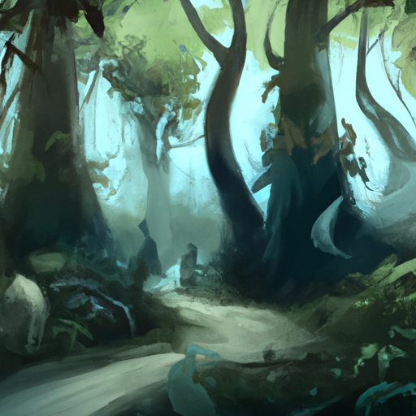

1. You find yourself in a dark and mysterious forest. You can hear the sound of birds chirping and the rustling of leaves in the wind. You have no idea where you are or how you got here. You can either explore the forest or try to find a way out.

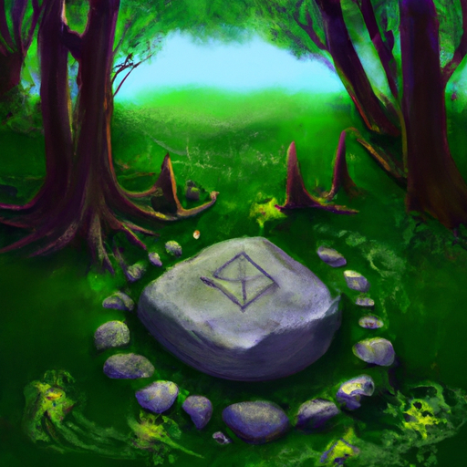

2. You decide to explore the forest and come across a small clearing. In the center of the clearing is a large stone altar with a strange symbol carved into it. You can either investigate the altar or continue exploring the forest.

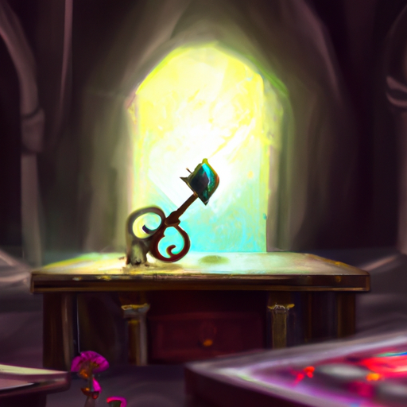

3. You decide to investigate the altar and find a small key hidden beneath it. You can either take the key or leave it behind.

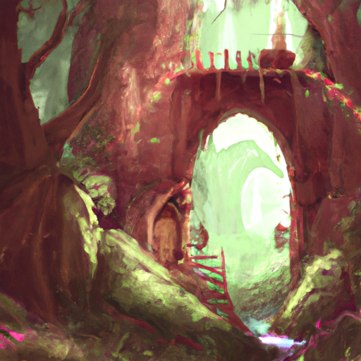

4. You take the key and continue exploring the forest. You eventually come across a large castle with a drawbridge. You can either enter the castle or turn back.

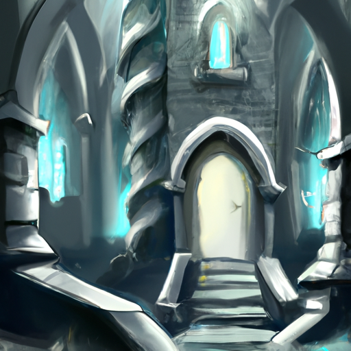

5. You decide to enter the castle and find yourself in a large hall. You can either explore the castle or try to find a way out.

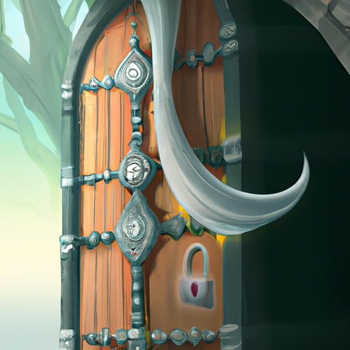

6. You decide to explore the castle and come across a large door with a strange lock. You can either try to open the door with the key you found or turn back.

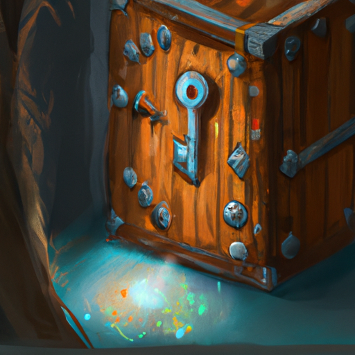

7. You try to open the door with the key and it works! You enter the room and find a large chest in the center. You can either open the chest or leave it alone.

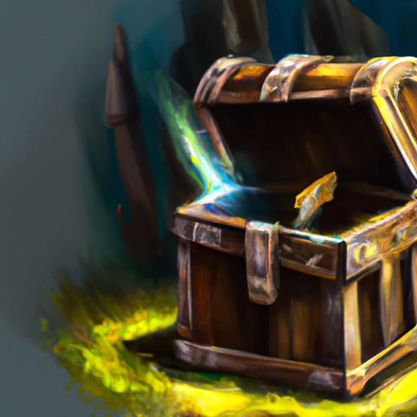

8. You decide to open the chest and find a magical sword inside. You can either take the sword or leave it behind.

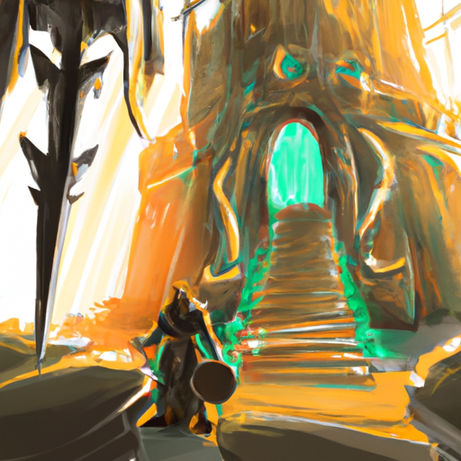

9. You take the sword and continue exploring the castle. You eventually come across a large throne room with a figure sitting on the throne. You can either approach the figure or turn back.

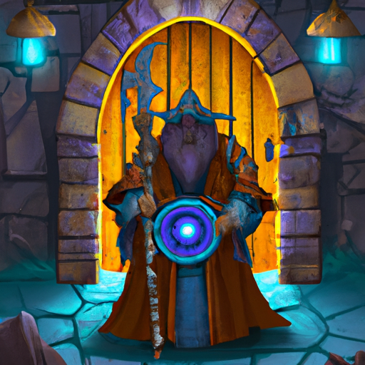

10. You decide to approach the figure and find out that it is a powerful wizard. He tells you that he has been trapped in the castle for centuries and that you are the only one who can free him. He gives you a magical amulet and tells you that if you can make it to the top of the castle, you can use the amulet to break the spell and free him. You can either accept the quest or turn back.

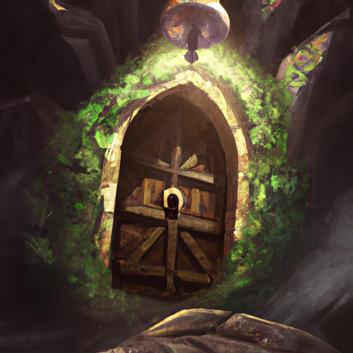

11. You accept the quest and make your way to the top of the castle. You find a large door with a strange lock. You can either try to open the door with the amulet or turn back.

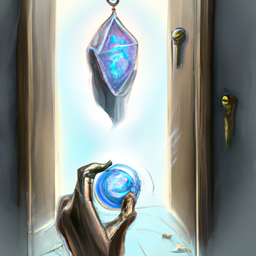

12. You try to open the door with the amulet and it works! You enter the room and find a large crystal in the center. You can either touch the crystal or leave it alone.

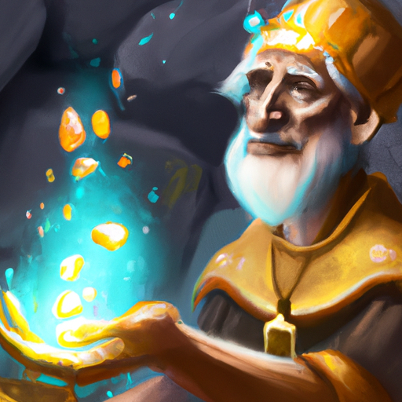

13. You decide to touch the crystal and the wizard is freed! He thanks you for freeing him and rewards you with a large sum of gold. You have completed your quest and can now enjoy your happy ending.

## path

: write fighting fantasy style 12 short scene, each one is numbered, each end have decision which lead to another scene number

## answer 

1. You are walking through a dark forest, the trees are so thick that you can barely see the sky. You come to a fork in the path, to the left is a path that is overgrown with vines and to the right is a path that is clear and well-trodden.

Decision: Do you take the left path or the right path?

A. Take the left path (Scene 2)
B. Take the right path (Scene 3)

2. You take the left path and find yourself in a clearing. In the center of the clearing is a large stone altar with a strange symbol carved into it. You can feel a powerful magical presence emanating from the altar.

Decision: Do you approach the altar or turn back?

A. Approach the altar (Scene 4)
B. Turn back (Scene 1)

3. You take the right path and find yourself in a small village. The villagers seem friendly and invite you to stay the night.

Decision: Do you accept the invitation or continue on your journey?

A. Accept the invitation (Scene 5)
B. Continue on your journey (Scene 6)

4. You approach the altar and feel a powerful magical force emanating from it. You can sense that something important is hidden here.

Decision: Do you investigate the altar or turn back?

A. Investigate the altar (Scene 7)
B. Turn back (Scene 2)

5. You accept the invitation and spend the night in the village. The villagers tell you stories of a powerful magical artifact hidden in the forest.

Decision: Do you believe the stories or continue on your journey?

A. Believe the stories (Scene 8)
B. Continue on your journey (Scene 6)

6. You continue on your journey and come to a large lake. On the other side of the lake is a castle.

Decision: Do you swim across the lake or find another way?

A. Swim across the lake (Scene 9)
B. Find another way (Scene 10)

7. You investigate the altar and find a hidden compartment containing a magical amulet. You can feel its power radiating from it.

Decision: Do you take the amulet or leave it?

A. Take the amulet (Scene 11)
B. Leave it (Scene 4)

8. You believe the stories and set off into the forest in search of the magical artifact. After hours of searching, you come across a large stone temple.

Decision: Do you enter the temple or continue searching?

A. Enter the temple (Scene 12)
B. Continue searching (Scene 8)

9. You swim across the lake and make it to the other side. You find yourself in a large courtyard surrounded by a high wall.

Decision: Do you climb the wall or explore the courtyard?

A. Climb the wall (Scene 13)
B. Explore the courtyard (Scene 14)

10. You find another way across the lake and come to a large cave. You can hear strange noises coming from inside.

Decision: Do you enter the cave or turn back?

A. Enter the cave (Scene 15)
B. Turn back (Scene 6)

11. You take the amulet and feel a surge of power course through your body. You can sense that the amulet is connected to something powerful.

Decision: Do you keep the amulet or return it to the altar?

A. Keep the amulet (Scene 16)
B. Return it to the altar (Scene 7)

12. You enter the temple and find yourself in a large chamber. In the center of the chamber is a pedestal with a glowing orb on top of it.

Decision: Do you take the orb or leave it?

A. Take the orb (Scene 17)
B. Leave it (Scene 8)

# 2nd result

What can I do for you today?: write fighting fantasy style 12 short scene, each one is numbered, each end have decision will lead to another scene (target) (json format)

1: You are walking through a dark forest, when you come across a fork in the road. Do you go left or right?

Decision:
Left: 2
Right: 3

2: You take the left path and come across a small clearing. In the center of the clearing is a small cottage. Do you enter the cottage or keep walking?

Decision:
Enter Cottage: 4
Keep Walking: 5

3: You take the right path and come across a small river. Do you cross the river or turn back?

Decision:
Cross River: 6
Turn Back: 1

4: You enter the cottage and find an old man sitting in a chair. He looks up at you and says, "Welcome, traveler. What brings you here?" Do you tell him the truth or lie?

Decision:
Tell Truth: 7
Lie: 8

5: You keep walking and come across a small bridge. Do you cross the bridge or turn back?

Decision:
Cross Bridge: 9
Turn Back: 1

6: You cross the river and come across a small village. Do you enter the village or keep walking?

Decision:
Enter Village: 10
Keep Walking: 11

7: You tell the old man the truth and he smiles. He tells you that he knows of a secret passage that will take you to your destination. Do you take the passage or keep walking?

Decision:
Take Passage: 12
Keep Walking: 5

8: You lie to the old man and he scowls. He tells you to leave and never come back. Do you leave or stay and fight?

Decision:
Leave: 5
Stay and Fight: 13

9: You cross the bridge and come across a small cave. Do you enter the cave or keep walking?

Decision:
Enter Cave: 14
Keep Walking: 11

10: You enter the village and find that it is deserted. Do you explore the village or keep walking?

Decision:
Explore Village: 15
Keep Walking: 11

11: You keep walking and come across a large lake. Do you swim across the lake or turn back?

Decision:
Swim Across: 16
Turn Back: 1

12: You take the secret passage and find yourself in a large chamber. In the center of the chamber is a large chest. Do you open the chest or keep walking?

Decision:
Open Chest: 17
Keep Walking: 18

13: You stay and fight the old man and after a long battle, you emerge victorious. He tells you of a secret passage that will take you to your destination. Do you take the passage or keep walking?

Decision:
Take Passage: 12
Keep Walking: 5

14: You enter the cave and find yourself in a large chamber. In the center of the chamber is a large chest. Do you open the chest or keep walking?

Decision:
Open Chest: 17
Keep Walking: 19

15: You explore the village and find a small chest in one of the houses. Do you open the chest or keep walking?

Decision:
Open Chest: 17
Keep Walking: 11

16: You swim across the lake and come across a small island. Do you explore the island or keep swimming?

Decision:
Explore Island: 20
Keep Swimming: 21

17: You open the chest and find a magical sword. Do you take the sword or leave it?

Decision:
Take Sword: 22
Leave It: 23

18: You keep walking and come across a small bridge. Do you cross the bridge or turn back?

Decision:
Cross Bridge: 9
Turn Back: 12

19: You keep walking and come across a small bridge. Do you cross the bridge or turn back?

Decision:
Cross Bridge: 9
Turn Back: 14

20: You explore the island and find a small chest. Do you open the chest or keep exploring?

Decision:
Open Chest: 17
Keep Exploring: 24

21: You keep swimming and come across a small island. Do you explore the island or keep swimming?

Decision:
Explore Island: 20
Keep Swimming: 25

22: You take the sword and feel a surge of power. You know that this sword will be useful in your quest. Do you keep walking or turn back?

Decision:
Keep Walking: 5
Turn Back: 12

23: You leave the sword and continue on your journey. Do you keep walking or turn back?

Decision:
Keep Walking: 5
Turn Back: 12

24: You keep exploring the island and come across a small chest. Do you open the chest or keep exploring?

Decision:
Open Chest: 17
Keep Exploring: 26

25: You keep swimming and come across a small island. Do you explore the island or keep swimming?

Decision:
Explore Island: 20
Keep Swimming: 27

26: You keep exploring the island and come across a small cave. Do you enter the cave or keep exploring?

Decision:
Enter Cave: 14
Keep Exploring: 28

27: You keep swimming and come across a small island. Do you explore the island or keep swimming?

Decision:
Explore Island: 20
Keep Swimming: 29

28: You keep exploring the island and come across a small bridge. Do you cross the bridge or turn back?

Decision:
Cross Bridge: 9
Turn Back: 26

29: You keep swimming and come across a small bridge. Do you cross the bridge or turn back?

Decision:
Cross Bridge: 9
Turn Back: 25

